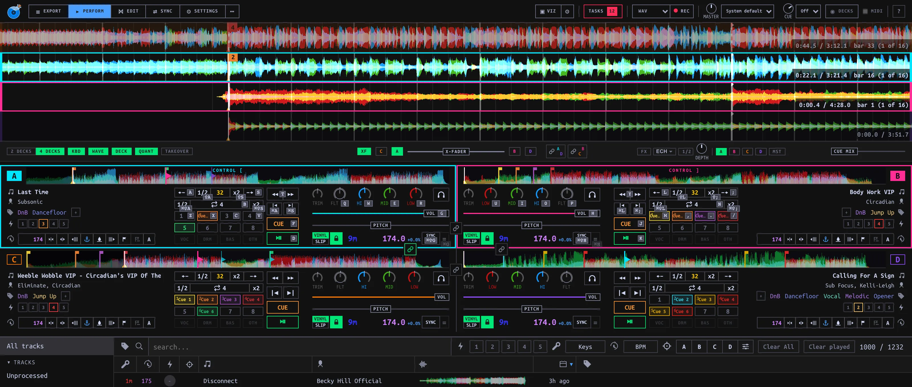
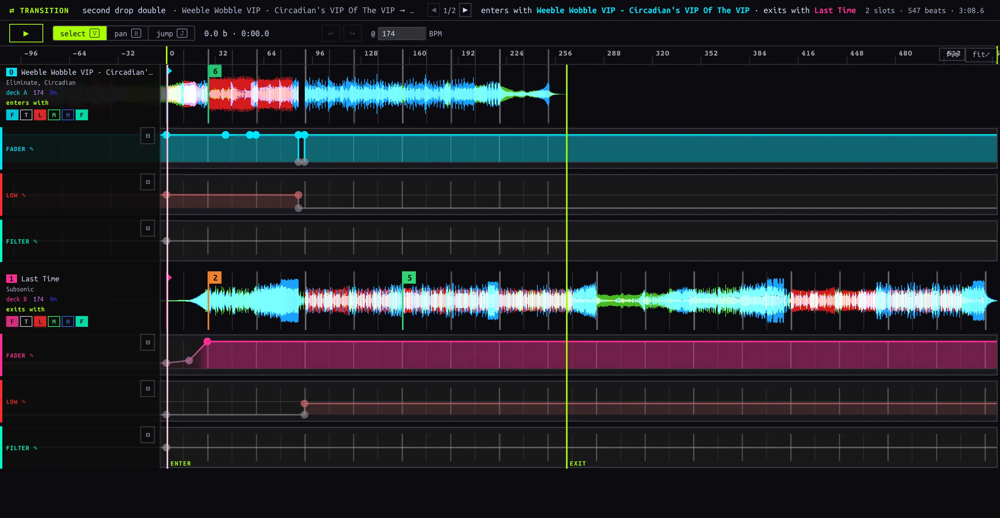
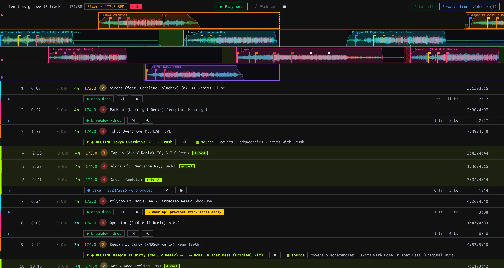
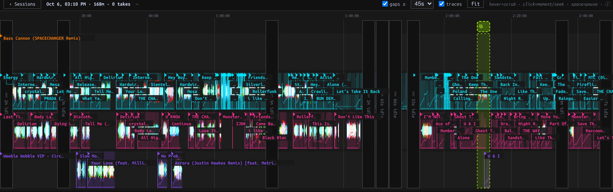
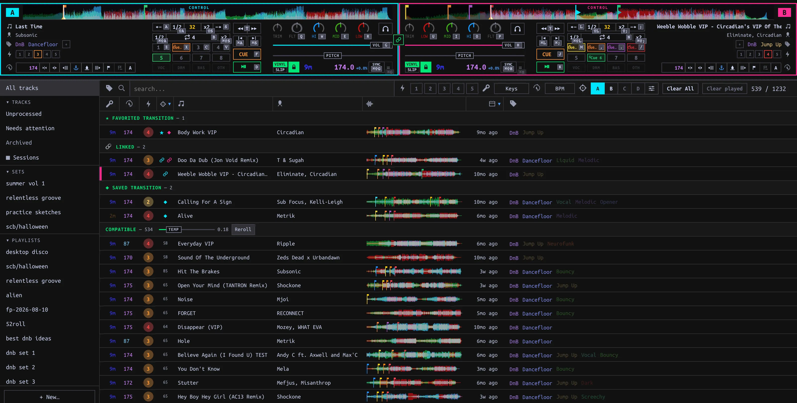
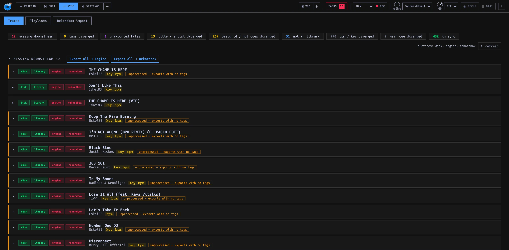

# manaDJ

DJ software for keyboard, mouse and controllers: four Decks, a Mixer, a Mix editor, Sets, Sessions and a Track Library.

> **Prerelease:** v0.1.0-rc.3. No backward-compatibility guarantees yet. Windows x64 is untested on Windows hardware.

[Website](https://manadj.murt.dev) · [Install and Setup](https://manadj.murt.dev/install.html) · [Current prerelease](https://github.com/murtaza64/manadj/releases/tag/v0.1.0-rc.3)

## Install

- **macOS:** [Apple Silicon DMG](https://github.com/murtaza64/manadj/releases/download/v0.1.0-rc.3/manaDJ-0.1.0-rc.3-arm64.dmg). Drag into Applications; first launch: right-click → Open. Not notarized.
- **Windows:** [x64 installer](https://github.com/murtaza64/manadj/releases/download/v0.1.0-rc.3/manaDJ-0.1.0-rc.3-x64-setup.exe). SmartScreen: More info → Run anyway. Untested on Windows hardware.
- Setup covers Rekordbox import, music folder, Cue mode, SoundCloud, Soulseek and controller check. Steps are skippable.
- Rekordbox import never writes to Rekordbox. Export is off by default.
- Data: `~/Library/Application Support/manaDJ` on macOS; `%APPDATA%\manaDJ` on Windows. Imported music stays in place.
- [Installation details, updates and troubleshooting](docs/install.md).

## Performance

- Keyboard and mouse control transport, Hot Cues, loops, EQ, filters and volume.
- Beat FX: Echo, Reverb and Flanger; number-row keyboard controls.
- Controller mappings: Pioneer DDJ-GRV6, DDJ-SB3 and Hercules Inpulse 300 MK2.
- Drag Tracks onto Decks; mute or solo stems.



## Mix editor

Edit Transition and Routine timing, automation and jumps; audition through the Decks and Mixer.



## Sets

Order Tracks and pin handovers. The Conductor plays the Set; a Deck or Mixer gesture returns control to you.



## Sessions and Takes

Sessions capture live Deck and Mixer events, not audio. Replay a passage, review Takes, and Promote selected Takes into saved mixes.



## Library and Follow

Assign Tags and Energy, order Playlists, and use Follow to filter next-Track candidates from loaded Decks.



## Sync

Compare Tracks and Playlists with Rekordbox and Engine DJ; choose what to Import or Export.



## Development

Requires [uv](https://docs.astral.sh/uv/), Python 3.13+, Node.js and npm.

```sh
uv sync
make dev
```

- Browser: http://localhost:5173. Desktop shell: `make electron`.
- Tests: `uv run -m pytest`; `npm test --prefix frontend`.
- Agent and lane workflow: [AGENTS.md](AGENTS.md).
- Terms: [CONTEXT.md](CONTEXT.md). Changes: [CHANGELOG.md](CHANGELOG.md).
