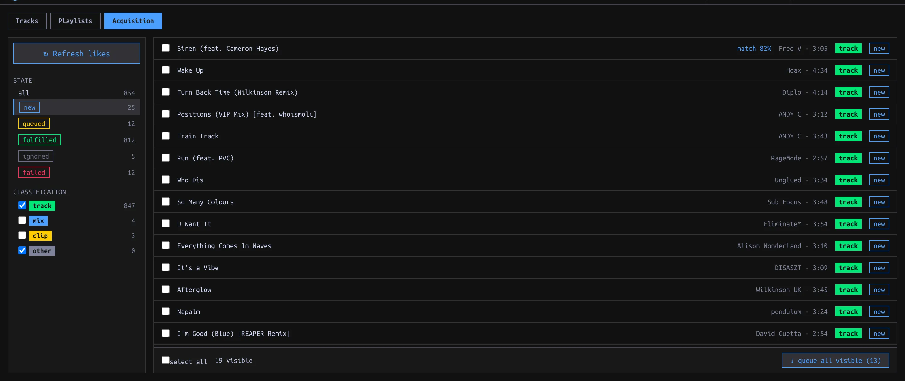

## Prepare the sources {#prepare}

Set **Settings → Library → Tracks directory** for downloads and connect **SoundCloud** in **Settings → Accounts** (or its Setup guide). A connected SoundCloud account reveals **SYNC → Acquisition**; connection alone does **not** refresh likes. Soulseek is optional: connect it under **Settings → Accounts** to show its picker and standalone search. For account connection steps, see [first run](../start/index.html#accounts).

## Review your likes {#review}

1. Open **SYNC → Acquisition** and click **↻ Refresh likes**. Check the reported new and total local counts. The refresh adds unseen SoundCloud likes, classifies them and looks for Library matches. Unliking on SoundCloud does not delete an item already recorded in manaDJ.
2. Start with the **new** state list. The default classification filter shows **track** and **other**; check **mix** or **clip** to reveal those suspected classifications. Click a row’s classification chip to cycle **track → mix → clip → other** if it was misclassified. Classification filters visibility; it does **not** mark an item ignored.
3. Click an item to inspect the detail panel. Compare a proposed SoundCloud↔Library match before choosing **accept match** or **reject**. An accepted match fulfills the Source Item without downloading another copy. For a match the scanner missed, use **manual link**, search by title, artist or filename, and pick the correct Library Track. Optionally record **audio from** (a URL or label such as `cd-rip`) as asserted provenance; this is not a download by manaDJ. A confirmed correspondence means the Track is already accounted for.

| State/filter | Meaning / next action |
| --- | --- |
| **new** | Not fulfilled; check for a proposed match, link manually, queue download, or **ignore**. |
| **queued** | Download requested; its task badge shows pending/running/done/failure. A failed task remains a queued item. |
| **fulfilled** | Linked to a Library Track, either from an existing match or a completed acquisition. Check provenance before assuming it was downloaded. |
| **ignored** | Removed from the active worklist; **restore to new** reverses the decision. |
| **failed** | Filter for queued items whose latest download task failed; inspect the item error and choose recovery. |

## Get missing audio {#download}

1. In a new unmatched item’s detail panel choose **⇣ queue download** for SoundCloud. For a batch, check rows and choose **⇣ queue selected**; with none checked, **⇣ queue all visible** uses the *current filtered list*, not all likes. Check the reported **queued / skipped** counts. Pending match proposals and non-new items are not ordinary queue candidates.
2. Watch the status badge or **TASKS**. On failure, read the error in item detail; **retry via soundcloud**, **ignore**, or link to an existing Track. If Soulseek is connected, inspect its suggested search, edit the query, compare result filename/format/bitrate/size/duration and peer queue, then select a candidate. **⚡ auto mp3** attempts an MP3 candidate and may try other peers. The standalone **soulseek search** expander can fetch a Track without any SoundCloud item.
3. After a successful download, check the Track in the Library. The download is saved in the configured tracks directory, imported, linked to the Source Item with recorded provenance, and marked fulfilled. Verify metadata, Tags and Energy; fulfillment does not mean curation is complete. See [curation](../curate/index.html#edit-track).

Treat a manually asserted audio source differently from a recorded download: you can update an assertion, but cannot replace manaDJ-recorded download provenance with an assertion.
