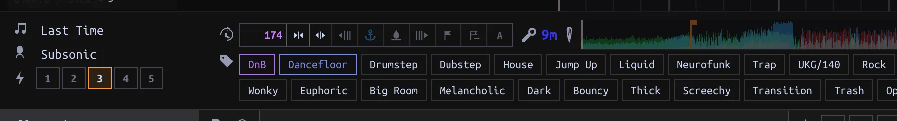
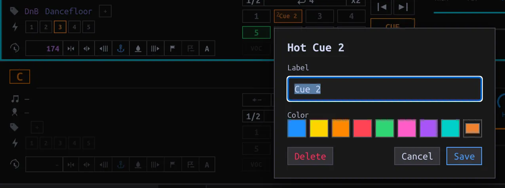

## What runs on import {#automatic-analysis}

Adding a Track queues its waveform and missing Beatgrid/Key work. **TASKS → Background tasks** shows pending, running, completed and failed jobs; use **Retry** on a failed task. Open **Unprocessed** to curate Tags/Energy and **Needs attention** to find a Track whose grid analysis bailed without saving a grid. Those are different lists. A failed grid fit can show an **!** with diagnostics in the loaded Track panel. Automatic analysis preserves imported or manually edited grids, and imported/manual Keys; a bail with diagnostics is not silently retried on every startup.

## Re-analyze deliberately {#reanalyze}

1. Load the Track onto a Deck; check its current BPM, grid and Key. Select **A** in its tempo/Beatgrid controls (also available in Performance). While a task is already pending or running, Analyze is disabled or deduplicated.
2. Watch **TASKS** and wait for completion; inspect the grid against the waveform and the resulting Key. A successful **manual Analyze** overwrites even an imported or hand-edited grid and an imported/manual Key when detection succeeds. It is **not a preview**. If the grid fit bails, existing grid/BPM stay; if no Key is detected, existing Key stays.
3. If detection is off, use the Deck’s grid controls: **Nudge grid earlier/later** to align the marks, **Set downbeat at playhead** for the bar origin, or **Anchor drop at playhead** to align grid and cue ladder. Check several phrases, not only one transient. A BPM edit changes the projected tempo; consult [Sync](../sync/index.html#performance-data) before replacing an external grid.

The **A** at the right end of the tempo/grid cluster queues Analyze; the adjacent buttons adjust the saved grid. The anchor icons mark downbeat and drop. These controls write to the loaded Track, not a selected row.

## Main cue and Hot Cues {#cues}

The **Main cue** is the Deck’s single Cue point and is distinct from eight numbered **Hot Cues**. Set the Main cue at the desired playhead position with the Cue controls; the saved position belongs to the Track. To place a Hot Cue, move the playhead and press an **empty** numbered pad. With Quantize on and an available Beatgrid, placement snaps to the nearest beat. Pressing a **filled** pad triggers/jumps to that cue instead of creating another. **Shift-click** a pad to remove it; right-click a **filled** pad to edit its label and color, then **Save** (or **Cancel** without a change). While paused, **Previous/Next Hot Cue** steps through cues and moves the Deck Cue as well.

If you anchor a drop, inspect any existing cues before changing the ladder. The convention often puts Hot Cue 4 at the drop, with 3/2/1 progressively earlier; it is a curation convention, **not** a requirement for every Track. [Cue mode in first run](../start/index.html#cue-mode) determines how a paused Deck responds when a Hot Cue is held; it does not alter saved cue positions.
