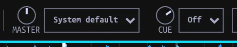

## Set audio outputs {#outputs}

The **MASTER** bus is what the room hears; the **CUE** bus is the headphone mix. They have independent top-bar gain and device selectors. The Mixer strip's **CUE MIX** controls how much pre-fader preview and Master signal reaches the headphones; it does not select a device.

1. In the top bar, choose the device beside **MASTER** for the sound sent to your speakers. **System default** follows the computer's default output.
2. Choose the device beside **CUE** for headphones. **Off** disables the Cue bus.
3. On a multichannel interface, select explicit stereo pairs. The Inpulse 300 MK2's verified assignment is Master 1/2 and Cue 3/4; for other hardware confirm by listening with **Test tone** under **Settings → Controllers → Controller check**. A generic stereo device offers a single output choice.
4. Adjust the top-bar **MASTER** and **CUE** knobs for their separate levels.

The screenshot shows the sandbox on **System default / Off**. Your available physical outputs depend on your device; a saved, unplugged controller from another machine is not an available destination. Output selectors refresh when opened; after plugging in a device, reopen a selector if its first list has not updated.

## Preview in headphones {#pfl}

1. Load a Track on a Deck, then enable that channel's headphone-icon **PFL** button (pre-fader listen).
2. Start Deck playback, turn up the top-bar **CUE** level, and set **CUE MIX** toward cue-only (left). More than one PFL channel may be enabled at once; their signals mix together.
3. Bring **CUE MIX** toward the right to blend in Master; fully right is Master only. Double-click it to return to cue-only. Lower the channel fader to keep that Deck out of Master while listening on PFL.

PFL hears a channel after trim, EQ and sweep filter, *before* its channel fader, Beat FX and crossfader. Master in the headphone mix is after the crossfader and Master Beat FX, but before the Master volume knob. To hear a Deck-target Beat FX through headphones, listen to the resulting Master signal instead of its PFL tap.

Output choices are saved. If a saved device is unplugged, Master falls back to the system default and Cue turns off without changing saved choices. Explicit pairs on a device whose physical order has not been verified must be selected; the app does not guess that the first pair is safe. On an interface carrying both buses, assign them separate pairs. When routed to separate devices, the Cue signal uses a different output path; test both buses before performing.

| Symptom | Check |
| --- | --- |
| Master silent | Loaded/playing Deck, trim, EQ/filter, channel fader, crossfader and assignment, top-bar MASTER gain/output. |
| PFL silent but Master audible | Top-bar CUE output (not Off/unplugged), CUE gain, channel PFL enabled, CUE MIX not fully toward Master. |
| PFL works but Deck FX absent | Expected: PFL taps before Beat FX. Hear processed program using the Master side of CUE MIX. |
| Select shows unavailable device | Reconnect and reopen it, or choose a currently available output pair. MIDI recognition alone does not route audio. |

## Choose paused Hot Cue behavior {#cue-mode}

Cue mode controls Hot Cue playback, independently of headphone routing.

Open **Settings → Help → Setup → Cue mode**, choose a mode, and click **Continue**:

- **Gated**: hold a Hot Cue on a paused Deck to preview from it; release returns to the cue.
- **Trigger**: press a Hot Cue to jump there and start playback; releasing keeps it playing.

You can change the saved preference directly with **GATED** in Performance: lit means Gated, unlit means Trigger. It applies across Decks to keyboard, controller, and on-screen Hot Cues. On a playing Deck, both modes jump. The Main cue keeps its hold behavior in either mode.

A Gated preview follows normal mixer routing. Enable PFL and keep the channel out of Master when you want that preview only in headphones.

Main Cue is separate: holding it at its marker previews until release in either mode, while pressing it during playback returns and pauses. Quantize can affect where cues are placed; it does not choose Gated versus Trigger.
