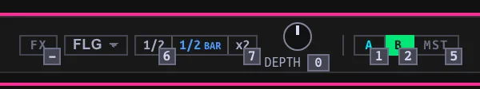

## Use Beat FX {#effects}

The Mixer has one shared Beat FX section. Select one Deck or **MST** for the whole mix.

1. Choose **ECH** (Echo), **RVB** (Reverb), or **FLG** (Flanger) from the effect selector.
2. Select **A**, **B**, **C**, **D**, or **MST** as the target. C and D are available in the four-Deck layout.
3. Set the length with **1/2** and **x2**, or scroll over the length readout.
4. Click **FX** to turn the effect on. Move **DEPTH** left for more original audio or right for more effect. Far left is dry, far right is wet; center carries both. Double-click the knob to reset it to center. Switching the section off or changing target lets an existing effect tail ring out.

Echo repeats at the selected beat length. Reverb does not follow the length control. Flanger uses that length for one sweep cycle and reads **bars by default**: **1 BAR** means four beats. Change its **Length unit** under **Settings → Performance → Beat FX** if you prefer beats. The ladder is ¼, ½, ¾, 1, 2, 4, 8: buttons marked **1/2** and **x2** move one rung, so moving from ½ to ¾ is not literal doubling. Beat FX initially has Echo selected but is off at center depth until enabled.

In Performance, with deck keyboard controls active:

- **1–5** select A, B, C, D, and Master respectively.
- **6 / 7** shorten or lengthen the timing.
- **8 / 9** select the previous or next effect.
- Hold **0** and move the mouse to adjust depth; double-tap **0** to center it.
- **-** toggles FX on/off.

The number row is available only in Performance with Deck keyboard focus (not while typing or in Tab browser focus). C/D targets are hidden in two-Deck layout. Hold **0** while moving the mouse up/right to increase depth, down/left to decrease; its center detent requires a brief pause before passing through. A nearly stationary double-tap of 0 returns to center. The on-screen DEPTH knob also accepts drag, wheel and double-click. These are different from the 1–8 Hot Cue pads in the standalone Library.

If nothing changes, check the target, its channel fader, FX on/off, depth and **---** (no effect selected). A Deck-target effect sits after its channel fader but before the crossfader; MST sits on the combined post-crossfader signal, before Master gain. PFL listens before Beat FX; blend Master into [CUE MIX](../audio/index.html#pfl) to hear the processed mix in headphones. Closing a fader stops new audio entering the effect, but existing tails can ring out. MST uses the last selected Deck target as its tempo source. A Sampler target exists in the controller action vocabulary but has no audible sampler bus or on-screen target.

## Controller Beat FX {#controller-fx}

The controller and keyboard manipulate the *same* section, not independent effects. On the DDJ-GRV6, CH SELECT chooses a channel or Master, SELECT chooses Echo/Reverb/Flanger (other detents choose no effect), ON/OFF gates, BEAT arrows step timing, and LEVEL/DEPTH changes the bipolar blend. On the DDJ-SB3, an FX-1/2/3 button engages its named effect on that side's focused Deck; Shift+FX targets Master, and pressing the active pairing again switches it off. Its side LEVEL knob changes depth only when the active target matches that side's focused Deck (either side may adjust Master). Length remains on-screen/keyboard on the SB3. Inpulse 300 MK2 FX controls are not mapped. See [controller status and takeover](../controllers/index.html#mapping).

## Tune the sweep filters {#filters}

The per-channel filter is separate from Beat FX: turn left for low-pass, right for high-pass, and return to center to open it.

1. Load and play a track, then open **Settings → Performance → Filters**.
2. Choose a filter model and move a Deck's filter to hear it.
3. Adjust **Resonance**, **Peak compensation**, and **Sweep curve** while listening. **Center deadzone** controls the neutral area; **Drive** adds saturation.
4. Use **Reset filter defaults** to restore the starting sound.

Filter and Beat FX sound settings apply live and persist across launches. Filter preferences affect every Deck, PFL, existing Transitions, and Session replays. Changing those preferences does not move the Deck filter controls. Most tuning controls are fixed in **Original 12 dB**; **Peak spread** applies only to **Twin peak 24 dB**.

The filter is a *per-channel* control, unlike the one shared Beat FX section. In Performance, hold **Q/P** (focused left/right Deck) plus mouse to sweep it; double-tap the key to center. Center is neutral, with a detent that briefly catches the movement. Beat FX sound tuning is separate: **Settings → Performance → Beat FX** contains Echo feedback/saturation, Reverb decay/damping/stereo width, and Flanger delay/sweep/feedback plus the Bars/Beats unit. **Reset effect defaults** restores those sound parameters; selecting effect/target, gating, depth and length are live section controls rather than saved sound presets.
