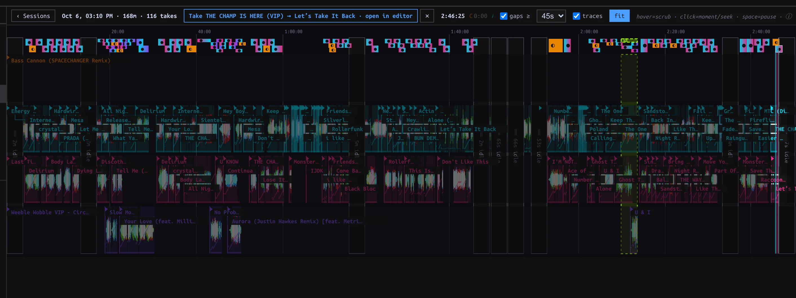
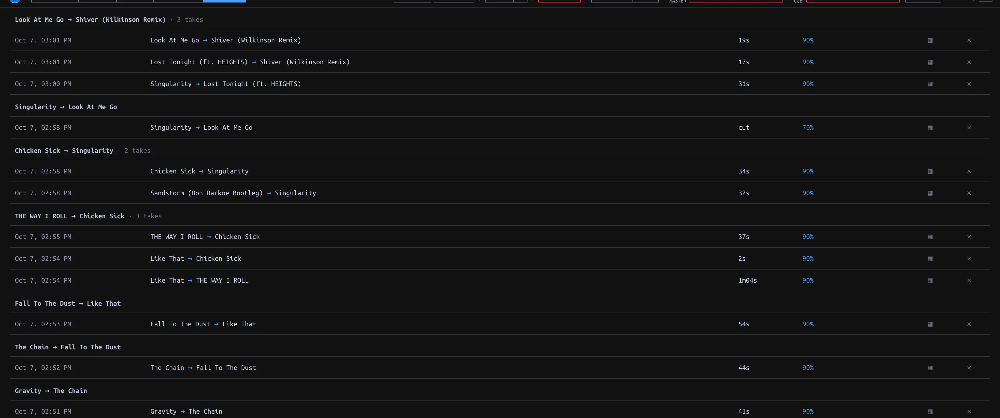

## What capture keeps {#sessions}

Capture runs during live Performance without a Record button. A Session opens on the first **Master-audible** Deck instant. Silent loads and headphone-only Cue do not start it; ten uninterrupted minutes without Master-audible activity end it. The next live audible stretch starts another Session. Sessions store transport and control **events, not audio**; replay needs the Library Tracks. Editor auditions and Conductor playback show as machine-held stretches, not captured performances. A short Master-audible preview can keep a Session active without counting as a played Track or a Take.

| Record | Scope | How to find it |
| --- | --- | --- |
| **Session** | Whole stretch of live Deck/Mixer events, across up to four Decks | Library sidebar **▦ Sessions** |
| **Take** | Detected pair handover inside an engagement | Session timeline or top-bar **⋯ → HISTORY** |
| **Cameo Take** | Guest comes and goes while host remains current | Session timeline/history; not an ordinary handover Transition |
| **Routine Take** | Confirmed multi-Track passage | Session candidate controls and Mix editor review |

## Open and replay a Session {#timeline}

1. Choose **▦ Sessions** in the sidebar. The list groups by day, longest first; rows show time, duration, Master-audible Track count and Take count. Choose **Open timeline**. **‹ Sessions** returns to the list.
2. Read the physical Deck lanes **C, A, B, D** and Track labels. Waveforms show played portions; height indicates Master gain. Hover for a moment's readout, then click a moment to select it. **fit** frames the Session. Horizontal wheel/trackpad pans; vertical wheel zooms around the cursor.
3. At the selected moment press **▶** beside its timestamp to replay recorded events through the shared live Decks. Pause/resume or **■ Stop replay**; **Space** toggles pause. A manual Deck or Mixer gesture ends replay and takes over. Replay is not new captured evidence.
4. Use **gaps ≥** to choose the minimum collapsed gap (30s, 45s, 2m or 5m); click a collapsed gap to expand it. **traces** toggles transport traces. Machine-controlled gaps contain tenure markers rather than the machine's individual control events.

*Selected Take exposes **open in editor** above four physical Deck lanes and the collapsed gaps.*

Deleting a Session from the list removes its event timeline and mined candidates, **not its persisted Takes**; the row says **Delete this Session (Takes are kept)**. Confirm what provenance you need before deleting; this action is not an editing shortcut.

## Find and review a Take {#takes}

A handover Take is detected only when the incoming Track becomes Master-audible and the outgoing eventually stays silent. Brief returns can belong to the same engagement; not every blend yields a Take. If the guest ends while the host continues, the evidence is a Cameo Take instead. Headphone Cue and automated playback cannot create handover Takes.

Click a Take chip on the Session timeline, then **open in editor**. Or choose top-bar **⋯ → HISTORY** to browse engagements by time, window, confidence and promotion state. The **▦** link jumps back to a source Session when present. A handover row opens an editable **REVIEW** draft in the [Mix editor](../editor/index.html#promote). Inspect and audition, then **↑ Promote** to save a Transition; opening it alone creates no library Transition. The Take remains evidence. A Cameo Take in history currently links back to its Session rather than launching the same handover review flow.

*Engagement-grouped Take history with duration, confidence and source Session links.*

## Multi-Track candidates {#routine-evidence}

The Session timeline can surface mined Routine candidates. Select one, trim its proposed span and inspect its cast. **Confirm Routine Take** retains a chosen passage as evidence; **Promote** turns a reviewed Routine Take into a saved Routine. If trimming a selected candidate leaves two Tracks, **Cut Take instead** offers pair evidence. This is **not** a general drag-any-range cutting tool on the Session timeline. A candidate and its promoted artifact are different records; do not confuse a suggested span with a saved Routine.
