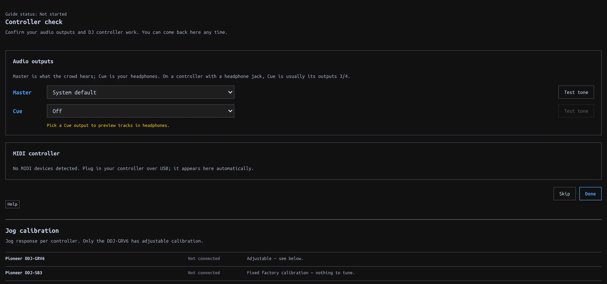

## Check your controller {#check}

MIDI control and audio output are separate connections. A controller may send button presses while its Master/Cue jacks are unconfigured, or supply audio while no Mapping is detected. The on-screen [Performance controls](../perform/index.html#keyboard) continue to work without a controller.

1. Plug in the controller over USB and open **Settings → Controllers → Controller check**. You can also launch this guide alone from **Settings → Help → Setup**.
2. Choose **Master** and **Cue** outputs and use each **Test tone** button. Pick explicit output pairs when offered; listen to confirm which pair reaches speakers and which reaches headphones. Do not assume the pair order from the controller's name.
3. Under **MIDI controller**, find the device and check that it shows a **Mapping**.
4. Press a button or move a control. The guide displays its mapped action and counts the controls checked.
5. Click **Done**, or **Skip** to return later.

Supported models are the Pioneer DDJ-GRV6, Pioneer DDJ-SB3, and Hercules DJControl Inpulse 300 MK2. **No Mapping** means detection succeeded but that device's controls cannot operate manadj. An **Unmapped control** message on a supported model means that particular control has no assigned action.

If no device appears, check its connection. Allow MIDI access if prompted; a browser reporting MIDI unavailable cannot run this check. MIDI detection and audio routing are separate: a responding button does not confirm the headphone output. See [audio outputs](../../install.html#controller-check) for output checks.

The check observes real controller input; mapped controls still operate the app while you test them. The screenshot above is the real app *without connected hardware*; it does not demonstrate MIDI receipt or verified physical outputs.

## How a Mapping relates to the app {#mapping}

A Mapping translates device messages directly to Deck/Mixer actions. It is not a second copy of the keyboard layout: hardware controls can address a Deck while you browse another view. The printed label on a device does not guarantee the assigned manadj action. Check the guide's reported action for the control you moved.

| Model | Deck/FX behavior | Verification |
| --- | --- | --- |
| AlphaTheta/Pioneer DDJ-GRV6 | Four mixer channels; each deck side switches between two Decks. Its CH SELECT, SELECT, BEAT, ON/OFF and LEVEL/DEPTH control the one shared Beat FX section. | Mapping hardware-verified; check your own audio pair order. |
| Hercules DJControl Inpulse 300 MK2 | Two Decks; separate Master and Cue level controls. Its FX section is not mapped. | Mostly hardware-verified, with exceptions in the mapping guide. |
| Pioneer DDJ-SB3 | Each side switches both its Deck controls and mixer channel between Decks. Side FX buttons share one section, rather than providing two independent processors. | Mapping exists; not hardware-verified. |

Absolute faders/knobs normally use **TAKEOVER**: after a view or layer changes a value, a mismatched physical control waits until it crosses the on-screen value before taking over. This avoids an abrupt jump; switch **TAKEOVER** off in the Performance strip only if you want immediate movement. Layer switches re-arm pickup on layered controllers. A controller can focus C/D independently of the keyboard's **[ / ]** focus switches.

The GRV6's own Master/headphone gain and mix controls are handled in hardware, not MIDI-mapped to the app. For GRV6/SB3 audio, explicitly choose and test the available output pairs; only the Inpulse's 1/2 Master and 3/4 Cue defaults are hardware-verified in the app. See [audio routing](../audio/index.html#outputs) and [Beat FX mapping](../beat-fx/index.html#controller-fx).

## Tune jog response {#jog-calibration}

Only the DDJ-GRV6 has adjustable jog calibration. Open **Settings → Controllers → Jog calibration**, or **Calibrate jog wheels** in Controller check when a GRV6 is detected.

1. Load a track in Performance and test a small rim movement during playback.
2. Adjust **Playback bend gain** for sensitivity and **Playback bend clamp** for the maximum bend. **Playback decay window** controls how the bend settles.
3. Pause and compare **Paused bare rim** with **Paused touch platter**. Adjust the response that feels too fast or slow.
4. Test Shift seeking before changing **Shift fast-seek base** or its acceleration controls.

Changes apply live and are saved. Use **Reset jog defaults** to start again. The SB3 uses fixed factory calibration; the Inpulse needs no calibration here. Computer-mouse jog controls are separate, under **Settings → Keyboard + mouse → Mouse jog**.

## When a control does nothing {#troubleshooting}

| Symptom | Check |
| --- | --- |
| No device in Controller check | Reconnect USB, allow MIDI access, and verify the device is not held by another app. MIDI unavailable in this browser cannot be fixed by selecting an audio output. |
| Device present, **No Mapping** | This model is detected but its controls have no registered Mapping. Use on-screen or keyboard controls. |
| **Unmapped control** | Only that message/control is unsupported; test another binding. A controller's printed label is not a binding promise. |
| Mapped knob/fader seems stuck | Bring it through the app value to pick it up with **TAKEOVER** enabled. Recheck after changing the hardware Deck layer. |
| Buttons respond, headphones silent | Controller MIDI is working; check **CUE** output, PFL, headphone level and CUE MIX separately. |
