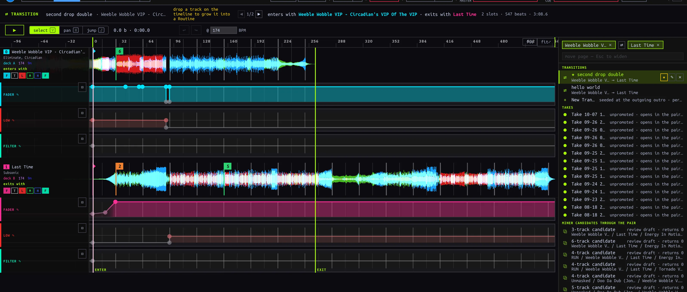
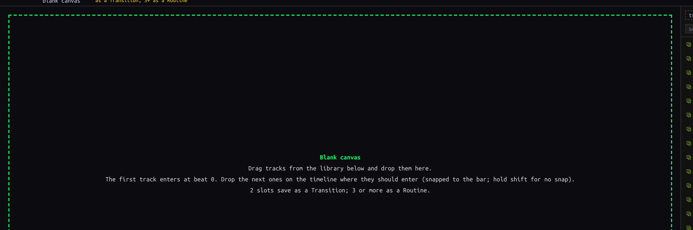
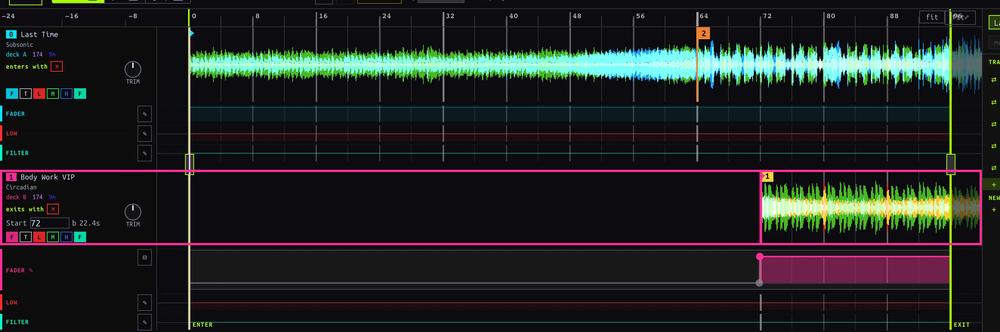
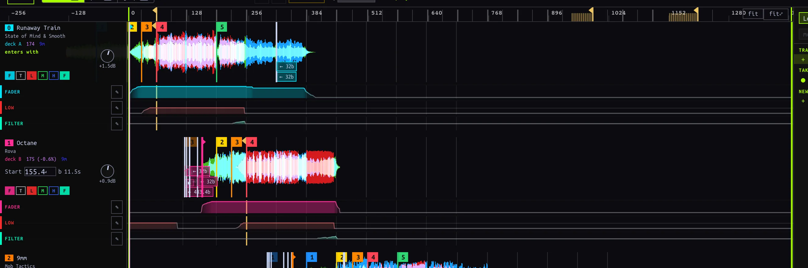
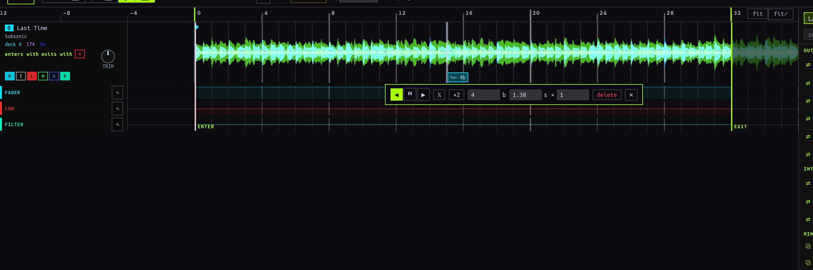
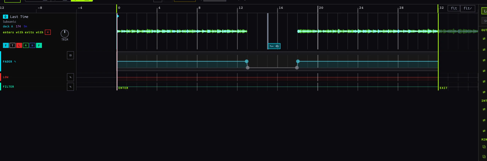
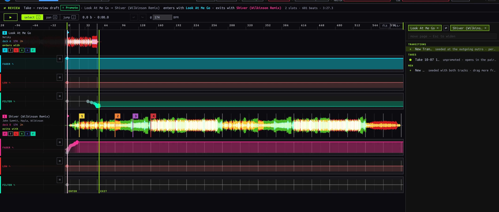

## Find or start a mix {#editing}

Open **EDIT**. The right-hand picker is a navigator, not a Deck: search for a Track, use the loaded-Deck shortcuts, or choose a saved artifact. One Track chip lists moves out of and into it; two chips specify an **ordered** outgoing → incoming pair. **⇄** reverses that direction. With two chips, choose a saved Transition, **New Transition**, an unpromoted Take, or **+ New blank mix** seeded with those Tracks. With no chips, browse Routines, Routine Takes and candidates, or start a blank mix. **↑/↓** and **Enter** navigate picker results; **Escape** clears the search, then the second chip, then the first. The header's **◀/▶** cycle siblings of the current pair or cast. A Cameo may appear in the picker, but its editor currently reports that Cameo editing is not available here.

*Ordered pair in the picker; Select, Pan, Jump, undo and audition controls above the timeline.*

| Start | What exists immediately | What saves it |
| --- | --- | --- |
| **New Transition** for an ordered pair | A two-slot seeded draft | The first actual edit, via autosave; opening or auditioning does not save |
| **+ New blank mix** | A blank, in-memory draft; selected Track chips seed slots | Two slots become a Transition, three or more a Routine, after an edit; zero or one never persist |
| Saved Transition or Routine | The existing artifact and its editable timeline | Subsequent edits autosave |
| Unpromoted Take or Routine candidate | A review draft over captured evidence | **↑ Promote**, not audition or navigation |

## Add and arrange slots {#blank-mix}

1. Choose **+ New blank mix**. Drag a Library Track onto the empty canvas; drag another onto the timeline. The insertion line displays its entry beat. Drop location snaps to a four-beat bar; hold **Shift** while dropping to place between bars. A Track without BPM is skipped. Hot Cue 1, if present, supplies its initial playback position; otherwise it starts at the beginning. Multiple dragged Tracks enter in succession.
2. Read each slot panel: its number is **entry order**, not the letter of a physical Deck. The first slot enters with the mix; the last exits with it. A Track can occur in more than one slot. Newly added slots receive an initial closed-to-open fader step; expand the lane to adjust it.
3. Use **Select (V)** and drag a waveform row horizontally to shift its entry and authored material. Drag vertically across a neighboring row to reorder Routine entries. **Alt-drag** slides Track material under the clock without moving its authored automation. Hold **Shift** during a drag to bypass snapping. Click rows to select; **Cmd/Ctrl-click** toggles and **Shift-click** selects a range. Drag one selected row to move the selected group.
4. In a Routine, edit a later slot's **Start** beat or its left start handle to shorten or reveal its intro without shifting later events. Drag playback-bound handles to crop the Routine without deleting outside material; **↺** restores source bounds. The entry slot uses playback start instead. Pair Transitions do not have these Routine-only handles.
5. Use a slot panel's **✕** to remove an authored slot. The remaining slots re-number by entry position, while their lane and Jump edits stay with their original slot identities. Undo if removal was accidental.

*Zero-slot canvas: add the first Track from the Library below; nothing is saved yet.*

*Select-mode horizontal drag shifts the incoming slot from its seeded bar to a later bar.*

*Seven entry-ordered slots in a saved Routine; cast order is distinct from physical Deck assignment.*

**Current kind boundary:** zero or one slot remains a draft. Two slots persist as a Transition; three or more as a Routine. Adding a third slot to a saved authored Transition, or removing the third from a saved authored Routine, converts on save and re-points Set pins. Check the conversion notice and the Set afterward. A recorded Routine's immutable source cast is not a blank authored cast; do not assume removing a recorded slot changes its evidence.

## Select, Pan and Jump {#modes}

| Mode | Shortcut | Canvas gesture |
| --- | --- | --- |
| **Select** | **V** | Select slot rows; drag to align or reorder; edit expanded lane nodes and trim handles. Default mode. |
| **Pan** | **H** | Drag to navigate horizontally/vertically without moving a slot. Hold **H** momentarily, then release to return to the prior mode; a tap leaves Pan active. |
| **Jump** | **J** | Click a slot's waveform row to insert a Jump at that beat; select its marker to configure it. |

The ruler and empty timeline background seek rather than insert a Jump. **fit** frames the window; **fit⤢** includes surrounding Track material. Zoom around the cursor with Ctrl/Cmd-wheel or pinch, pan horizontally with a horizontal wheel gesture. **Escape** closes a Jump popup, clears a selection, then returns to Select.

To repeat a buildup, choose **Jump (J)**, click the slot waveform at the intended mix instant, then configure the popup: **◀** replays backward, **▶** skips forward, and **⏸** holds (Routine only). Set distance in beats **b** or seconds **s**, use **½ / ×2** to resize, and for backward Jumps set **×** repeats (1–64). The initial Jump is four Track beats backward. Drag the marker to change its time, or click it and choose **delete**. A recorded marker instead offers **✎ edit** (replace with an editable copy) or **remove** (play through the discontinuity). Removing recorded evidence changes the draft's interpretation, not the raw Session record. In Select, double-clicking a waveform also inserts a Jump.

*A backward four-beat Jump on a one-slot draft; direction, beats, seconds and repeats are editable in the popup.*

## Draw automation and stamp a Chop {#automation}

Use the lane chips under a slot to show **fader**, **LOW EQ**, **filter**, **trim**, **MID EQ** or **HIGH EQ** (fader, LOW EQ and filter show initially). On a recorded strip, click **✎** to author an editable envelope over it; **⊟** collapses the editor, and **↺** on a collapsed authored strip removes the authored override so the recorded lane plays again. A Transition has no editable trim lane.

In an expanded lane, click the curve preview to add a breakpoint, drag a point to change time or value, double-click it to delete. Drag empty lane space to box-select nodes; **Cmd/Ctrl-click** toggles a node, **Cmd/Ctrl-drag** selects a time span, and dragging a selected node moves the group. **Delete/Backspace** removes selected nodes (the lane keeps at least one). **Alt-drag** shifts the envelope in time. For a quick full cut, **Shift-drag** across empty lane space to stamp a rectangular **Chop** between beats, or **Shift-click** for a one-beat cut. The resulting walls are normal editable breakpoints. Shift also disables magnets during node moves.

*Shift-drag stamped a fader cut with editable walls; the waveform above reflects the cut.*

## Audition and take over {#audition}

Press **▶** or **Space** outside a text field to audition; the first press may show loading while the editor arms the shared Decks. Press again to cancel arming, or pause a playing audition. Opening an artifact alone does **not** claim the audible surface. Audition automation drives the shared Mixer; it is not captured as a new Take. A manual Mixer gesture or transport/pitch/jog/key-lock gesture on a driven Deck takes over: editor automation stops, but sounding Decks continue under your control. Gestures on an undriven Deck do not necessarily take over.

## Review a Take and Promote {#promote}

Open a handover Take from [Sessions or HISTORY](../capture/index.html#takes). The header reads **REVIEW**. The app derives an editable Transition draft from the recorded events: inspect slot timing, Jumps and lanes; adjust and audition before **↑ Promote**. The original Take remains separate evidence. A Routine Take or mined candidate opens a Routine review preview; promoting a candidate first confirms a Routine Take. Switching away from an unpromoted review loses its draft edits. A recorded Cameo Take is not currently promoted through the handover history action; do not treat a Cameo as a Transition merely because both appear in history.

*A handover Take opened for review; Promote is the explicit persistence action.*

## Saving, undo and errors {#saving}

There is no **Save** button. Edits to persisted artifacts autosave after a short pause (about 700 ms); **✎ edited** means a draft changed, **not** that the server acknowledged it. Wait for a write before leaving, especially after structural edits; navigation does not promise to flush a pending save. **↩ / ↪** or **Cmd/Ctrl+Z / Cmd/Ctrl+Shift+Z** undo/redo editor gestures. A drag is one history step. Selection and view navigation are not content changes. Undo history is scoped to the opened artifact, not a global history across mixes.

Authored Routine create/structure failures can show **Save failed: …**; some Transition and edits-autosave failures currently log to the developer console instead of displaying a visible recovery notice. If a change appears not to stick, stop editing, inspect the console/error, and verify by reopening the artifact; do not assume automatic retry. Promotion is a separate explicit write—check that the REVIEW badge changes before treating it as saved.
