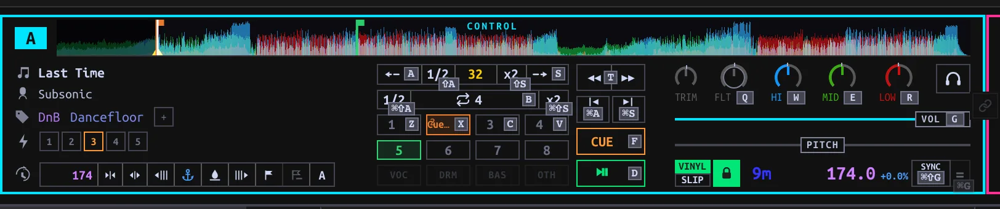
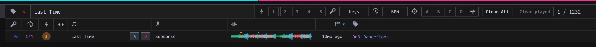

## Controls {#keyboard}

Open **PERFORM**. Its keyboard has two *hands*, not four separate Deck layouts: left-hand keys address the focused Deck A or C, right-hand keys address B or D. Click a Deck to focus it, or in **4 DECKS** press **[** to switch A/C and **]** to switch B/D. The focus indicator identifies the destination. **2 DECKS** keeps the two hands on A/B; it hides C/D without unloading them. A mapped [controller](../controllers/index.html#mapping) can operate the same Decks and Mixer without pretending to be keyboard input.

**?** or **F1** opens the current keyboard map. The **KBD** button toggles hints printed beside controls. Keys below apply with Deck keyboard focus, not while typing or when a dialog/menu owns the keys. On Windows/Linux, use **Ctrl** where the table says **Cmd/Ctrl**. **Space does not play a Performance Deck**: use D or K. With a Set selected, Space instead controls Set playback.

| Action | Left hand (A/C) | Right hand (B/D) |
| --- | --- | --- |
| Play/pause | D | K |
| Main Cue (hold) | F | J |
| Hot Cues 1–4 | Z X C V | M , . / |
| Remove a Hot Cue | Shift + pad | Shift + pad |
| Beatjump backward / forward | A / S | L / ; |
| Halve / double beatjump size | Shift+A / Shift+S | Shift+L / Shift+; |
| Auto-loop on/off | B | N |
| Halve / double loop length | Cmd/Ctrl+Shift+A / S | Cmd/Ctrl+Shift+L / ; |
| Previous / next Hot Cue while paused | Cmd/Ctrl+A / S | Cmd/Ctrl+L / ; |
| Match tempo once | Cmd/Ctrl+G | Cmd/Ctrl+H |
| Join / leave Sync | Cmd/Ctrl+Shift+G | Cmd/Ctrl+Shift+H |
| Filter, high, mid, low EQ (hold + move mouse) | Q W E R | P O I U |
| Channel volume (hold + move mouse) | G | H |
| Jog (hold + move mouse sideways) | T | Y |

Pads 5–8 use the on-screen Deck controls. Plain **=** toggles app-wide **QUANT**; the number row controls [Beat FX](../beat-fx/index.html#effects), not Hot Cues in Performance. Keyboard mappings in the standalone Library view differ from these Performance keys.

## Load {#loading}

1. Pick **2 DECKS** or **4 DECKS**. In the browser below the Decks, search for a Track or select a Playlist. Hover a row to expose its **A/B** (and, in four-Deck mode, **C/D**) Load buttons; click the target, or drag the Track onto that Deck or its waveform.
2. Alternatively, press **Tab** to hand the keyboard to the embedded browser. Use **J/K** or **↓/↑** to choose a row, **H/L** to move between sidebar and track areas, **Enter** to open a selected sidebar entry, and **/** to focus search. **A/B/C/D** load the selected Track to the named physical Deck; **Shift+A/B/C/D** toggles Follow for that Deck. In browse focus, Enter on a track row does *not* load it.
3. Press **Tab** again or **Escape** to return to Deck keys. Release any held key before switching modes: the same press cannot acquire a different meaning midway. Wait for the Deck to show its loaded waveform before using cue, loops or pads. Play can be requested while loading.

With Deck keyboard focus, **↑/↓** move the browser cursor; **←** or **Enter** load onto the focused *left* Deck, **→** onto the focused *right* Deck. Double-clicking a row targets the focused left Deck. A playing Deck refuses a replacement Load; pause it first. **Cmd/Ctrl+F** focuses browser search. Enter or Escape *inside* search exits the field without clearing the filter.

With browser focus, **Home/End** jump to the first/last entry; **PageUp/PageDown** move a page, and **Ctrl+U/D** move half a page. Hold **Shift** with row navigation to extend selection; **Cmd/Ctrl+A** selects all visible rows. **F** opens Follow parameters, **N** toggles Known only. Browser focus belongs to the embedded Performance list; the standalone Library has a different shortcut map.

## Cue, jumps and loops {#cues}

**Main Cue** and the eight **Hot Cues** serve different purposes. While paused away from Main Cue, press F/J to place it; at Main Cue, hold to preview and release to return, unless Play takes over. While playing, Main Cue returns to its marker and pauses. An empty Hot Cue pad places a cue; an assigned pad jumps while playing. While paused, a pad either previews until released (**GATED**) or starts playback that continues after release (**TRIGGER**). Change this with **GATED** in the Performance strip; see [Cue mode](../audio/index.html#cue-mode). Walking Hot Cues with Cmd/Ctrl+A/S or L/; while paused also moves Main Cue.

Beatjump moves by the Deck's selected jump size (initially 32 beats, 1–128); Shift+the jump key changes that size, not the loop length. A jump during a loop translates the loop instead of exiting it. **B/N** engages or releases an auto-loop of the selected length (initially 4 beats, ⅛–128). Change that length with Cmd/Ctrl+Shift+the jump keys. The loop needs a Beatgrid. Quantize snaps eligible cue placement and loop entry to beats; it does not change the jump-size keys.

**MATCH** applies a one-time tempo match to a playing reference. **SYNC** joins/leaves a shared tempo that you can ride with the pitch fader. With Quantize and suitable playing/gridded Decks, either can also align phase once; a pitch move or jog nudge does not repeatedly realign it. Sync entry needs a ready Track with BPM. These are independent of selecting a Deck for keyboard focus.

## Mixer {#mixer}

Each Deck has trim, EQ, a sweep filter, channel level and PFL. The crossfader routes according to each Deck's assignment when **XF** is enabled; disabling XF passes channels at unity instead. To work the keyboard Mixer, hold **Q/W/E/R** (left) or **P/O/I/U** (right), then move the mouse up/right to increase or down/left to decrease. Hold **G/H** for channel level. Release to finish. This is a held-key pointer gesture, not clicking the knob. EQ and filter stop at their neutral center detent; pause briefly there, then move again to pass it. Double-tap the *key* while the mouse stays still to toggle an EQ between cut and neutral or a channel volume between cut and full; filter double-tap resets to center. Double-clicking the *on-screen* knob has its own reset (EQ neutral, volume full). If pointer lock is denied, click the app, release, and retry.

For silent Master audio, check the channel level, EQ kills, filter, crossfader assignment and **XF**, then [Master output](../audio/index.html#outputs). For silent headphones, check PFL, CUE MIX and Cue output separately.

## Mouse jog {#mouse-jog}

Hold **T/Y** and move horizontally. While playing this nudges the timing (pitch bend); while paused it seeks. With **VINYL** on, hold **Shift+T/Y** for platter contact and move horizontally to scratch; release Shift or the jog key to end the scratch. Vinyl off does not scratch. The on-screen jog also accepts mouse motion. Configure the keyboard/mouse response under **Settings → Keyboard + mouse → Mouse jog**; hardware jog calibration is a [separate controller setting](../controllers/index.html#jog-calibration).

## Stems {#stems}

Choose **EXTRACT STEMS**, then **STEMS READY — RELOAD** when extraction finishes. Click a stem part to kill/restore it; **Shift-click** solos it. Disabled part buttons mean stems have not been loaded into this Deck. Stems processing and Deck loading are distinct operations.
