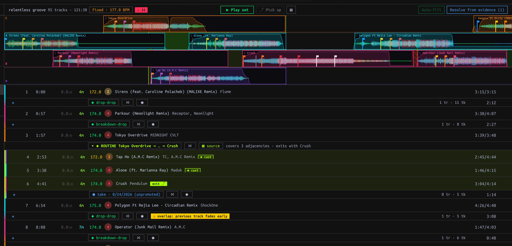
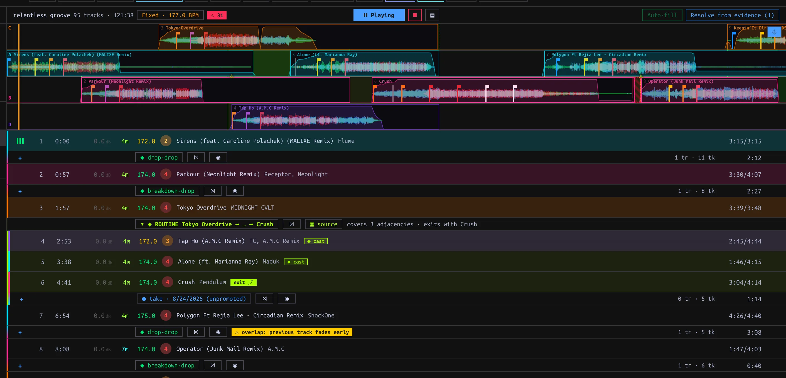

## Create and arrange {#planning}

In the Library sidebar choose **+ New… → Set**, enter a name and press **Enter** or **✓**. Drag Library Tracks onto the Set's sidebar row or into its detail pane. Existing entries are skipped. A Set is distinct from a Playlist: a Playlist preserves curatorial Play order for Export; a Set records playable handovers. A Set's context menu includes **Create playlist from set** when you need a Playlist copy.

Click the Set to open its ordered rows and the **Overview ladder**. Drag entries to reorder; click to select, Shift-click a range, Cmd/Ctrl-click to toggle, then Delete/Backspace to remove. The row menu also has **Move track(s)** → **Move here** and **Remove from set**. **+** between entries opens suggestions for insertion; **+ suggest a track** at the end appends. Suggestions change the order, not the pin for a boundary. A broken adjacency's pin goes dormant and returns if that ordered pair becomes adjacent again in the same Set.

*Each boundary shows its current pin and evidence count; a Routine spans multiple consecutive entries.*

## Choose the move at each boundary {#pins}

Click an adjacency pin chip to open its picker. The chip shows the effective move and the evidence counts (**tr** saved Transitions, **tk** Takes). Hover warning marks to inspect plan problems.

| Picker choice | Plan effect |
| --- | --- |
| **Unpin (auto-resolve from the library)** | Use the pair's favorite saved Transition, otherwise the most recently edited; with none, hard-cut. New saved Transitions can change this choice. Takes never auto-resolve. |
| Saved **Transition** | Pin this specific saved move, unaffected by saving another one for the pair. |
| Specific **Take** | Deliberately pin the idealized interpretation of that evidence; it has not been promoted to a Transition. |
| **✂ hard cut** | Force a cut even if Transitions exist. |
| Matching **Routine** | Cover the matching consecutive cast entries rather than only a pair. The picker may also offer Routine evidence/candidates. |

**↳ pin** freezes an auto-resolved Transition. **Auto-fill** freezes available auto-resolved Transitions in bulk and does not pin Takes. **Resolve from evidence** previews suggested Take pins for unresolved gaps plus remaining hard cuts; inspect short **⚠ chop** Takes before **Pin N Takes**. An **unpracticed** marker means the pair has neither saved Transition nor Take, not necessarily that its pin is unresolved. A Cameo is a separate guest pin on a host Track entry; it does not add a step to the Set order.

Use a boundary's **⋈** to open it in the [Mix editor](../editor/index.html#editing). **◉ Practice this handover** stops the Conductor and cues the pair on Decks A/B for a manual mix; pressing it again re-cues. Merely opening practice does not create a Take: a qualifying live handover must occur and settle.

## Play and inspect {#playback}

Press **▶ Play set** to start the Conductor on the shared Decks and Mixer. Its **⏸ Playing** control pauses; **⏹** stops and pauses the Decks. A row's hover **▶** starts at that entry. Click the Overview ladder to seek, including into a handover: if idle this starts playback there; during a run it retains the current play/pause state. Horizontal wheel pans; vertical wheel zooms. **⌖** toggles follow-playback; manual scrolling disengages follow. **▤** hides the ladder without stopping playback.

*Conductor playing from the Set; warning chips mark plan conditions to inspect.*

The first Track starts at its beginning. Without an applicable Transition, a boundary cuts after the outgoing Track ends and starts the incoming at Hot Cue 1, or at its beginning. A pinned Take plays its vectorized rendition, not raw recorded events. The header **Riding** / **Fixed · N BPM** chip chooses tempo policy: Riding returns Tracks toward native tempo between handovers; Fixed uses the editable **Set tempo** for the whole Set. Review **⚠ N** and adjacency warning tooltips for collisions, shortened tails or other plan flags.

## Manual takeover and Pickup {#takeover}

Moving a Conductor-driven Deck or Mixer control stops automation and leaves the Decks sounding for live mixing. This differs from **⏹ Stop**, which also pauses them. Capture resumes after manual takeover; machine-controlled Set playback does not generate Takes. **⤴ Pick up** resumes the plan from live state only when it maps cleanly; hover an unlit control for the reason (for example a Track outside the Set or a misaligned blend). Fade a stray Deck before retrying. Current Pickup state matching is limited to A/B even though Conductor playback may use C/D; do not count on four-Deck Pickup. Changes to Set order, pins or Transition edits can re-plan an active run.
