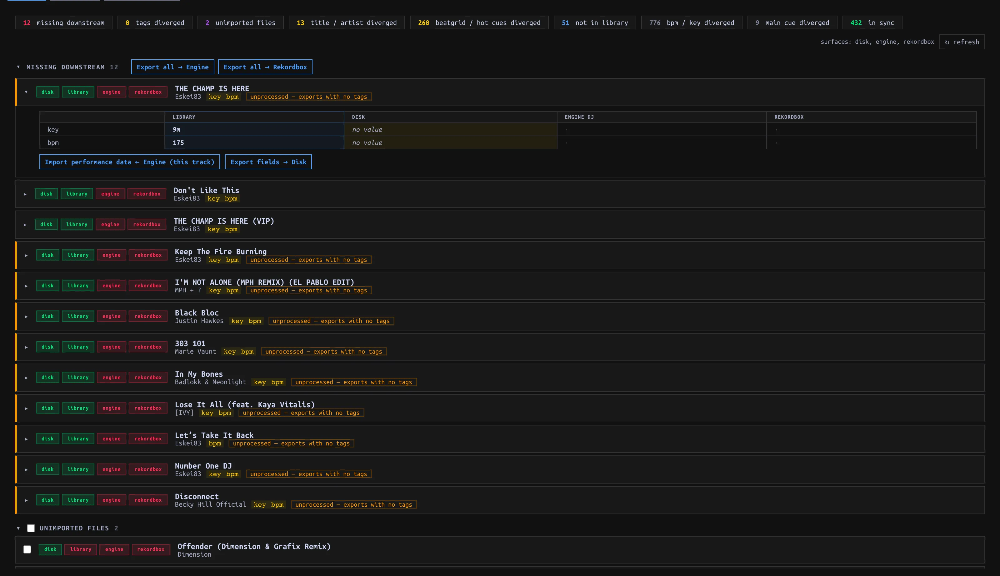

## Inspect before choosing a direction {#inspect}

Open **SYNC → Tracks** and press **↻ refresh** to update status. The inbox groups **Missing downstream**, **Tags diverged**, **Unimported files**, **Title / artist diverged**, **Beatgrid / hot cues diverged**, **Not in Library**, **BPM / key diverged**, and **Main cue diverged**. Some groups start collapsed. Each Track is filed under one highest-priority group; count chips can also list all Tracks with a particular condition. An unavailable external library is **unknown**, not proof that its Tracks are missing.

Expand a Track to compare **Library / Disk / Engine DJ / Rekordbox** values. The matrix’s **← import** reads a value **into** manaDJ; an export arrow writes **out**. ⚠ warns when an empty Library value would be skipped by Export. **Visual diff** overlays performance data. This status matrix is a comparison, not a dry-run plan for every action: read the scope/confirmation before proceeding.

### Choose the import operation {#import-choices}

| Need | Control | Effect / scope |
| --- | --- | --- |
| Add audio found in your configured directory | **Unimported files → select rows → Import N selected → Apply** | Rescans the directory and creates only selected new Library Tracks; audio remains in place. |
| Bring in Rekordbox-only Tracks | **Not in Library → Import all ← Rekordbox → Apply** | All Rekordbox-only Tracks, **not** selected rows. Engine-only rows do not have the same import action here. For a previewed first-time import with Tag/Playlist choices, use **Rekordbox import** instead. |
| Take a field changed elsewhere | Expand the Track, click the field’s **← import** | Title, artist, BPM, Key and Energy imports can apply **immediately**, not after a whole-page Save. Read the source column first. |
| Fill missing performance data from Engine | **Import performance data ← Engine** (section, Track or Library scope) | First call **immediately fills blanks** (e.g. missing cues/grid/Main cue/Key). It then lists saved values that differ for explicit overwrites. Dismissing that panel does **not** undo blanks already filled. |

For Engine performance conflicts, uncheck fields you do not want overwritten in the returned panel. For Hot Cues, **fill empty slots** keeps occupied Library slots; **replace all** replaces the set. **Apply N overwrites** authorizes only the listed Track/field pairs. Per-cell **← fill empty slots** and **← import** can apply immediately; replacement of existing grid or Cue presents a scope confirmation. Check the affected Track afterward. Manual [Analyze](../analysis/index.html#reanalyze) is another overwrite path, independent of Sync.

## External writes {#external-writes}

**Settings → Library → Export to Rekordbox / Engine DJ** starts **off**. Enable it deliberately to expose external-library write controls. Imports work with Export disabled. **Export fields → Disk** is a separate write to the *audio file’s tags* (title/artist/BPM/Key), not to Rekordbox or Engine DJ: the external-library Export gate does **not** protect Disk writes, and the per-row action has no Apply bar. Do not use it to test read-only Sync.

| Export action | Write behavior |
| --- | --- |
| **Missing downstream → Export all → Engine / Rekordbox** | Whole missing scope, confirmed with **Apply / Cancel**, not row selection. Creates missing external Tracks. Close the target app first; Engine export can skip Tracks whose drive has no owning Engine library. This is not the same as exporting performance fields. |
| **Tags diverged → Export tags → Engine / Rekordbox** | **Whole Library**, not just the shown count, with Apply confirmation. Encodes Tag structure/assignments and Energy into each target’s supported representation. **Rebuild Engine tag tree** deletes/recreates the generated tag playlists; use only when intended. |
| **Export new performance data → Rekordbox** | Additive: fills vacant Hot Cue slots and missing Key; does not auto-export a Beatgrid. |
| **replace in RB →**, **replace grid in RB →**, Key **export →** | Explicit replacement with Apply confirmation. Replacing cues reconciles Hot and memory cue mirrors including moves/deletions; replacing a grid rewrites Rekordbox analysis grid/BPM. Quit Rekordbox first. |

Export routes check the gate; external writes can snapshot external databases, but a snapshot is **not** an undo button. Verify the selected target, operation and scope rather than relying on a later restore.

## Playlists are a separate Sync {#playlists}

Open **SYNC → Playlists**, select a Playlist and compare the three **ordered** columns. With Export off, **Import from: Engine DJ / Rekordbox** targets manaDJ; with Export on, **Sync from:** a chosen source writes its order/membership to other available libraries. This replaces a target Playlist’s order/membership, not merely adding missing entries. Unmatched Tracks can stop a write; do not assume the detail view gives a dry-run or preflight confirmation of all unmatched Tracks.

For a manaDJ Playlist, **Export all data** (when Export is enabled) opens a **FULL PLAYLIST EXPORT** preview. Choose destinations separately; both start selected. Read per-destination create/replace, added/removed/moved and unmatched counts, then confirm. This operation replaces **Playlist order and performance/metadata fields** for matched Tracks—Hot Cues, Beatgrid, Key, Main cue, Tags and Energy. The preview is a Playlist plan, not a field-by-field preview. Quit target applications before writing and inspect the result, including skipped or failed rows.
